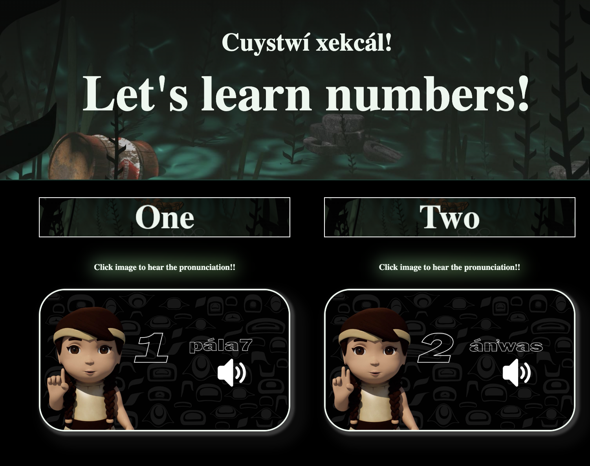
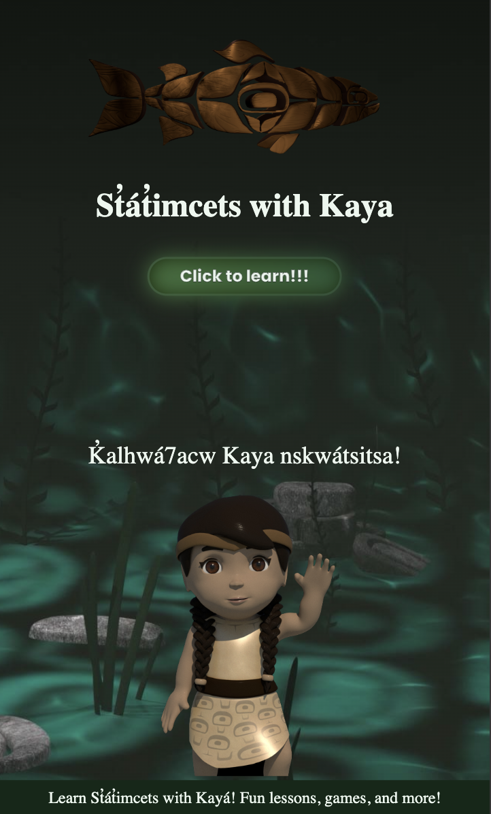

St'at'imcets with Kaya

## Description

St'at'imcets with Kaya is an interactive web app designed to teach children the St'at'imcets language. Through engaging lessons and fun games, the app promotes language revitalization and cultural connection for the St'at'imc community.

## Features

- Interactive lessons on numbers, and the alphabet. Colors, animals, common phrases, months, will be added next.
- Multiple-choice quizzes and 3D animated videos.
- A friendly character, Kaya, to guide users through the learning process.

## Screenshots

[View Demo](https://youtu.be/ZaN7_mWEFGY)

## Installation

1. Clone the repository:

   git clone https://github.com/frankie-mcdonald/frankie-mcdonald-statimcets-with-kaya

   cd frankie-mcdonald-statimcets-with-kaya

   npm install

   npm run dev

---

### How to use **\***

1. Ensure you cloned and run the server before launching.
2. npm run dev and command + click on the link. That should open up automatically in your browser.
3. Follow Kaya's guidance to explore lessons and play games.
4. Enjoy learning St'at'imcets!

## Overview

This is an app to teach the St'at'imc language, with learning resources with spelling and sound bites to hear the correct pronuncitation. Followed up with skill testing questions at the end of each lesson. These lessons will go from easy to hard with each users progress tracked. (something similar to duolingo).

## Problem Space

I have found that there aren't enough language resources for the St'at'imc nation. I feel that we need more fun ways to learn as we enter a digital age where most people are online and learn best given a challenge.

## User Profile

Anyone who wants to learn the St'at'imc language. It can also be used as a teaching tool in schools in the St'at'imc nation.

## Features

---User registration and authentication---

---Random word generator---

---Learning Modules---

---Progress tracking---

---Gamification/quizzes---

## Implementation

Tech Stack
React
Node.js
Express

## Future Implementations

-I will continue adding lessons like weekdays, body parts, common phrases, introductions, family members, etc. -I also want to implement matching games.
-A section where you can look up a word.
-a dashboard with improved tracking features
-add functioning login
